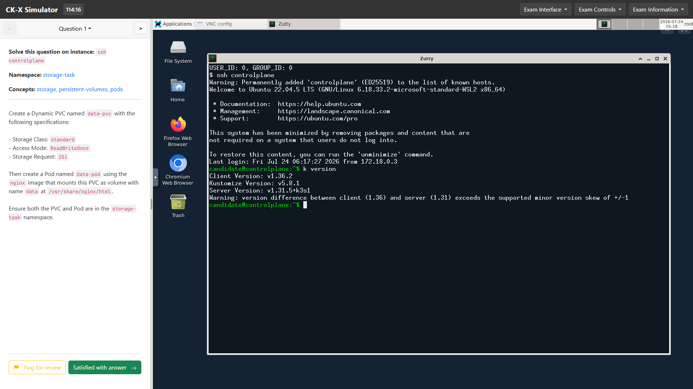

# CK-X Simulator

A self-hosted practice environment for the Kubernetes certification exams. It runs a real
cluster in Docker, gives you a browser-based Linux desktop and terminal, and grades every
task automatically against the live cluster.

## Purpose

Passing CKA, CKAD or CKS is mostly about speed and pattern recognition under a clock, which
means practice has to happen on a working cluster rather than on paper. This simulator gives
you that: you get a question, you solve it with `kubectl` on a real cluster, and a validation
script checks the result and tells you exactly what was missing. There are 145 graded tasks
across nine labs, and the two CKA mock exams are weighted to the real exam blueprint so
troubleshooting carries the largest share, as it does on the actual test.

The environment is disposable and self-contained. Every image is built from this repository
and official base images, so nothing depends on a third-party registry staying online. The
interface is available in English and Georgian, including the question text.

## Installation

You need Docker and Docker Compose, roughly 8 GB of free RAM, and about 10 GB of disk. Clone
the repository and bring the stack up:

    git clone https://github.com/grcheulishvili/CK-X.git
    cd CK-X
    docker compose up -d --build

That command is the same on Linux, macOS and Windows. On Windows use PowerShell with Docker
Desktop running; there is no need for WSL-specific steps. The first build pulls several
hundred megabytes and takes a few minutes, mostly for the desktop image. Subsequent builds
are cached and take seconds.

If you would rather not clone anything, `scripts/install.sh` (Linux and macOS) and
`scripts/install.ps1` (Windows) perform the same steps and check prerequisites first.

To stop everything, run `docker compose down`. To reclaim disk afterwards, `docker system
prune -af`.

## Access

Open http://localhost:30080 once the containers report healthy. That is the only port
published to the host, and it serves both the exam interface and the embedded desktop, so
nothing else needs to be exposed.

When a lab is running you work inside the browser. Each question names the machine to connect
to, and `ssh controlplane` from the desktop terminal puts you on the exam machine, which has
`kubectl`, `helm`, `docker` and `jq` preconfigured with the cluster's kubeconfig. Snippets can
be pushed from your own browser into the lab clipboard using the panel below the terminal,
which avoids needing a browser inside the VM.

## Lab categories

CKA covers cluster administration, networking, storage and troubleshooting. Two practice labs
(`cka-001`, 10 tasks; `cka-002`, 20 tasks) drill individual resource types, and two mock exams
(`cka-mock-01` and `cka-mock-02`, 17 tasks each, two hours) are shaped like the real thing.

CKAD covers application design, configuration, observability and deployment, across two labs
of 21 and 20 tasks.

CKS covers security: network policy, RBAC minimisation, Pod Security Admission, security
contexts and secrets, in a single 12-task lab.

The remaining category holds supporting tooling used across all three certifications: a
16-task Docker lab and a 12-task Helm lab.

Because the cluster is k3s running inside Docker, a few things behave differently from a
kubeadm cluster. Flannel does not enforce NetworkPolicy, so those tasks are graded on the
policy spec rather than on live traffic, and anything requiring node-level access such as
etcd backup or a kubeadm upgrade is graded on the command you write rather than executed.
`facilitator/assets/exams/READINESS.md` explains where the simulator matches the real exam
and where it does not.

## Contributing labs, fixes and translations

Everything that defines a lab lives under `facilitator/assets/exams`. The catalogue itself is
`labs.json`, which lists each lab with its id, category, difficulty, duration, question count
and the path to its assets. Each lab is then a directory such as `cka/001` containing four
things:

    assessment.json          questions, verification mapping, translations
    config.json              worker node count, pass thresholds, answers path
    answers.md               worked solutions shown after grading
    scripts/setup/           per-question environment setup
    scripts/validation/      per-question grading

A question in `assessment.json` carries an `id`, the `namespace` and `machineHostname` shown
to the candidate, the `question` body in Markdown, a list of `concepts`, and a `verification`
array. Each verification entry names a script in `scripts/validation` and the marks it is
worth, so a question can be partially credited. Validation scripts are plain shell: exit 0 to
pass, non-zero to fail, and anything they print on failure is shown to the candidate as the
reason, so a clear message there is worth writing.

Setup scripts run before the lab starts and must be named `qN_..._setup.sh`. The runtime only
picks up files matching that pattern, so a differently named script is silently ignored.
Validation and setup both execute on the exam machine, which is the same host the questions
tell candidates to use, so anything touching the filesystem has to happen there to be seen.

Two things are worth knowing before writing a validator. Make it capable of failing: a bare
`kubectl get ... | jq 'select(...)'` exits 0 even when nothing matches, so use `jq -e`. And
check that the task is satisfiable in this environment, for example that a required anti-affinity
rule does not ask for more nodes than `workerNodes` provides.

Run `python3 scripts/lint-exams.py` before opening a pull request. It checks that every
referenced validation script exists, that no validator can pass unconditionally, that setup
scripts match the naming pattern, and that shell syntax and line endings are clean. It should
report zero errors. `python3 scripts/gen-index.py` regenerates the exam index and keeps the
question counts in `labs.json` in sync.

Translations live alongside the source text rather than in separate files. Interface strings
are in `app/public/js/i18n.js`, which holds an English and a Georgian dictionary; both must
contain the same keys or the interface silently falls back to English. Lab names and
descriptions use `name_ka` and `description_ka` in `labs.json`, and question text uses
`question_ka` in each `assessment.json`. When translating, leave anything the candidate has to
type or match exactly in English, including resource names, namespaces, images, API fields and
commands, and translate only the surrounding prose.

## Credit

This is a fork of `sailor-sh/CK-X`, extended with CKS coverage, exam-weighted CKA mocks,
imperative-first solutions, Georgian localisation and a set of correctness and infrastructure
fixes.
